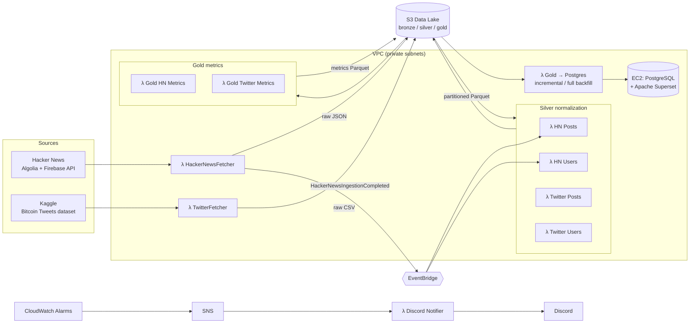

# Cloud Social Analytics

**A serverless data platform on AWS that collects, cleans, and analyzes social media data from Hacker News and X (Twitter), organized by the Medallion architecture (Bronze → Silver → Gold).**

All of the infrastructure is defined as code with **AWS CDK (Python)**: 14 stacks, 13 Lambda functions, a private VPC with least-privilege security groups, daily EventBridge schedules, Discord alerts for failures, and an Apache Superset dashboard backed by PostgreSQL.


---

## Personal Contribution

- For the first time I used and developed using AWS CDK (Python) to build a **serverless data platform on AWS**.

- Improved Bronze Layer.
- Implemented Silver Layer with normalization and enrichment.
- Implemented Data Visualization Layer with Gold metrics and Postgres loader.


---

## Highlights

- **Medallion data lake on S3.** Raw API responses go to `bronze/`, normalized and partitioned Parquet tables go to `silver/`, and aggregated metrics and KPIs go to `gold/`.
- **Event-driven pipeline.** The ingestion Lambda publishes a custom EventBridge event when it finishes, and that event starts the Silver normalization. Gold and loading jobs run on daily cron schedules.
- **Parallel ingestion.** Each day is split into 48 half-hour windows × 5 content types, giving 240 Algolia queries that run concurrently. This keeps every request under the API's per-query hit limit.
- **Data normalization.** HTML is stripped, Unix-epoch and ISO-8601 timestamps are unified to UTC, records are deduplicated, nested `kids`/`children` arrays are flattened into a relation table, and users get deterministic UUIDv5 IDs.
- **Data enrichment.** Missing post scores and user karma are filled in from the official Hacker News Firebase API, using a thread pool with retries and exponential backoff.
- **Memory-aware processing.** Large datasets are read in chunks with partition pruning, so multi-GB inputs fit within Lambda's memory limits.
- **Idempotent loading into PostgreSQL.** The loader builds tables automatically from the Parquet schema and upserts rows by composite primary key. It has two modes: a daily incremental load and a manual full backfill.
- **Network isolation.** Every Lambda runs in private subnets. S3 traffic goes through a Gateway VPC endpoint, and processing Lambdas may only send egress to the S3 managed prefix list. Postgres (5432) accepts traffic only from the loader's security group.
- **Secrets handled correctly.** Database and Superset credentials are generated in AWS Secrets Manager and fetched at runtime. They are never stored in environment variables.
- **Alerts through a CDK Aspect.** A custom `IAspect` adds a CloudWatch error alarm to every Lambda in the app automatically. Alarms send to SNS, which triggers a Lambda that posts a formatted message to Discord.

---

## Architecture



### Daily schedule (UTC)

| Time      | Job                                                                      | Trigger                                 |
|-----------|--------------------------------------------------------------------------|-----------------------------------------|
| 09:00     | **Bronze**: fetch all of yesterday's HN stories, comments, Ask HNs, jobs, and polls | EventBridge cron                        |
| on finish | **Silver**: normalize HN posts and users                                 | EventBridge custom event                |
| 10:00     | **Gold**: Hacker News metrics                                            | EventBridge cron                        |
| 10:30     | **Gold**: X metrics and Data Quality Score                               | EventBridge cron                        |
| 13:00     | **Load**: newest Gold partitions → PostgreSQL                            | EventBridge cron                        |
| any       | Notify Discord when any Lambda fails                                     | CloudWatch Alarm → SNS                  |

The X dataset is static (from Kaggle), so its ingestion and Silver jobs are run on demand. Manual variants of the HN Silver Lambdas can reprocess the full Bronze history.

---

## Data Model

### Bronze: raw data, unchanged

```
s3://data-lake-bucket-social-analytics/bronze/
├── hacker-news/year=YYYY/month=MM/day=DD/{story,comment,ask_hn,job,poll}/interval_NNN.json
└── twitter/Bitcoin_tweets.csv
```

### Silver: normalized, 3NF-oriented, Parquet

| Table            | Columns                                                                                     | Partitioned by      |
|------------------|---------------------------------------------------------------------------------------------|---------------------|
| `users`          | `user_id` (UUIDv5), `username`, `platform`, `karma_score`, `is_verified`, `followers_count`, `created_at` | `platform`          |
| `posts`          | `post_id`, `author_username` → users, `content_text`, `post_type`, `created_at` (UTC), `score` | `year/month/day`    |
| `post_relations` | `parent_id`, `child_id`, `relation_type` (flattened HN `kids`)                              | —                   |

`post_type` is one of `story`, `comment`, `ask_hn`, `job`, `poll`, `tweet`, or `retweet`.

### Gold: metrics and KPIs (star-schema style fact tables)

| Table                            | Description                                                      |
|----------------------------------|------------------------------------------------------------------|
| `daily_hn_posts_metric`          | Daily count of HN stories, Ask HNs, comments, jobs, and polls     |
| `daily_users_metric`             | New and cumulative users per day, per platform (HN and X)         |
| `top_twitter_users_by_followers` | Top 10 X users by follower count                                  |
| `top_hn_users_high_karma`        | Top 10 HN users with the **highest** karma                        |
| `top_hn_users_low_karma`         | Top 10 HN users with the **lowest** karma                         |
| `top_hn_jobs_by_score`           | Top 10 HN job postings by score                                   |
| `top_hn_posts_by_score`          | Top 10 HN stories by score                                        |
| `data_quality_score`             | **KPI**: percentage of non-null cells in each Silver table        |

---

## Network & Security

```
VPC (2 AZs, 1 NAT Gateway)
├── Public subnets  ── EC2 (PostgreSQL + Superset)
└── Private subnets ── all Lambda functions
    ├── S3 Gateway Endpoint
    ├── Secrets Manager Interface Endpoint
    └── EventBridge Interface Endpoint
```

| Security group        | Used by                          | Allowed traffic                                              |
|-----------------------|----------------------------------|--------------------------------------------------------------|
| `CollectorLambdaSG`   | Bronze fetchers                  | Egress 443 to external APIs (via NAT) and S3                 |
| `ProcessingLambdaSG`  | Silver (X) and Gold Lambdas      | Egress 443 **only to the S3 prefix list**                    |
| `HackerNewsUsersLambdaSG` | Silver HN Lambdas            | S3 prefix list and HTTPS to the HN Firebase API              |
| `DbLoaderLambdaSG`    | Gold → Postgres loaders          | S3 prefix list and 5432 to the EC2 SG only                   |
| `Ec2DatabaseSG`       | EC2 instance                     | Ingress 5432 **only from `DbLoaderLambdaSG`**; Superset UI   |

The S3 prefix-list ID is resolved at deploy time with a CDK `AwsCustomResource`. Each Lambda has its own IAM role, with S3 permissions limited to the prefixes it reads and writes. For example, Gold can only read `silver/*` and write `gold/*`.

---

## Tech Stack

| Area                 | Technologies                                                                 |
|----------------------|------------------------------------------------------------------------------|
| Infrastructure as Code | AWS CDK v2 (Python), CDK Aspects, Custom Resources                        |
| Compute              | AWS Lambda (Python 3.12 / 3.11), EC2 (Amazon Linux 2023)                     |
| Storage              | Amazon S3 (versioned, encrypted), Apache Parquet, PostgreSQL 15              |
| Data processing      | pandas, AWS SDK for pandas (`awswrangler`) Lambda layer                      |
| Orchestration        | Amazon EventBridge (cron and custom events)                                  |
| Networking           | VPC, private subnets, NAT, Gateway/Interface VPC endpoints, security groups  |
| Security             | IAM least privilege, AWS Secrets Manager, SSM Session Manager                |
| Observability        | CloudWatch Alarms, SNS, Discord webhooks                                     |
| Visualization        | Apache Superset (installed on EC2 by user-data and run by systemd)           |

---

## Project Structure

```
.
├── app.py                              # CDK app entry point and wiring between stacks
├── aspects/
│   └── lambda_alarm_aspect.py          # Adds an error alarm to every Lambda
├── cloud_social_analytics_stacks/
│   ├── network_stack.py                # VPC, endpoints, security groups
│   ├── notifier_stack.py               # SNS topic and Discord notifier
│   ├── bronze_layer_stacks/            # S3 data lake and ingestion Lambdas
│   ├── silver_layer_stacks/            # Normalization Lambdas (scheduled and manual)
│   ├── gold_layer_stacks/              # Metrics and KPI Lambdas
│   └── data_visualization_stacks/      # EC2 (Postgres + Superset) and loader Lambdas
├── lambdas/                            # Lambda source code, one folder per function
└── scripts/
    └── inspect_data_lake.py            # Local tool for row counts and null % per table
```

---

## Getting Started

### Prerequisites

- An AWS account and configured credentials (`aws configure`)
- Node.js and the AWS CDK CLI (`npm install -g aws-cdk`)
- Python 3.12+
- Docker, which is used to bundle Lambda dependencies

### Setup

```bash
# 1. Create and activate a virtual environment
python -m venv .venv
source .venv/bin/activate          # Windows: .venv\Scripts\activate.bat

# 2. Install dependencies
pip install -r requirements.txt

# 3. Configure environment variables
cat > .env <<EOF
CDK_DEFAULT_ACCOUNT=<your-aws-account-id>
DISCORD_WEBHOOK_URL=<your-discord-webhook-url>
EOF

# 4. Bootstrap (first time only) and deploy
cdk bootstrap
cdk deploy --all
```

The stack deploys to `eu-central-1`. Once it is running, Superset is available at `http://<ec2-public-ip>:8088`. The admin password is stored in the `AnalyticsDbSecret` secret in Secrets Manager.

### Useful commands

| Command            | Description                                  |
|--------------------|----------------------------------------------|
| `cdk ls`           | List all stacks                              |
| `cdk synth`        | Generate CloudFormation templates            |
| `cdk diff`         | Compare local code with the deployed state   |
| `cdk deploy --all` | Deploy every stack                           |
| `cdk destroy --all`| Remove all resources (the S3 bucket is kept) |

---